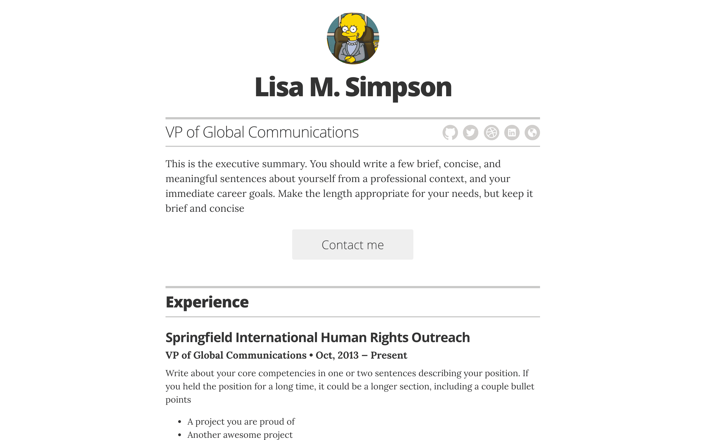

# Resume Template

This project was one of the first templates I attempted while experimenting with building a personal resume website. It is a simple resume template built using **Jekyll** and designed to be hosted easily with **GitHub Pages**.

The template demonstrates how a lightweight static site can be used to present a professional resume online. It is designed to be easily customizable through configuration files and layout edits, allowing users to modify sections such as experience, education, and skills to suit their own profiles.

By leveraging Jekyll and GitHub Pages, the template enables anyone to publish a personal resume website quickly and host it for free. It provides a basic structure that can be adapted, extended, or styled to create a personalized online resume.

## Disclaimer

Use of the **Lisa M. Simpson** image and name is included under **Fair Use for educational purposes**. The project license does not apply to this material.

Additionally, the demo content included in this repository should **not be used as your own resume content**.
